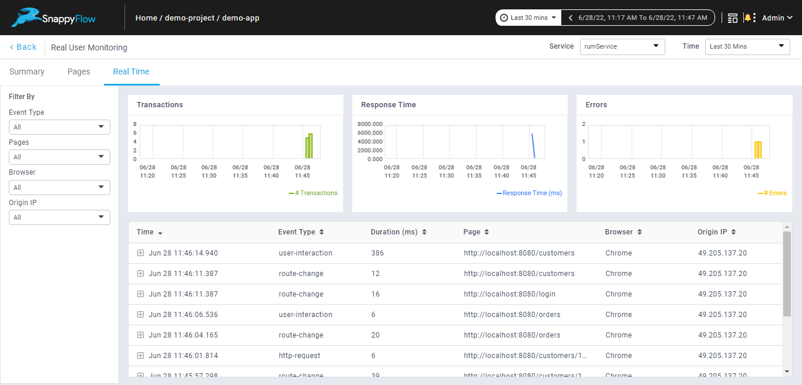

# RUM Dashboard

The Real User Monitoring Tab is available under the application dashboard just below the Tracing Tab. The various views of the data captured by the `sf-apm-rum` agent can be viewed under this tab. There are 3 panes that help us provide different views of the captured data.

- [Summary](#summary-pane)
- [Pages](#pages-pane)
- [Real Time](#real-time-pane)

## Summary Pane  

This pane provides the overview of the data captured. This view is helpful in understanding the statistics of the usage of the application. It helps the user to know the [Apdex Rating](./RUM_Metrics.md/#apdex-rating), Count of the pages used, [Average Response time](./RUM_Glossary.md/#response-time), Number of [Transactions](./RUM_Glossary.md/#transaction) occured, Number of [Errors](./RUM_Glossary.md/#error), Browser and [event](./RUM_Glossary.md/#event) breakups which helps the user to understand the current usage of the application. It helps the user to get the information about which type of event is predominant and the most used browser etc. The Apdex Rating helps the user understand the user satisifaction for a [target response time](./RUM_Glossary.md/#target-response-time) of 500 ms. Below is the snip of the Summary pane for a typical application.  

## Pages Pane

This pane provides the page wise statistics of the application. It provides the information such as top 10 [slow pages](./RUM_Glossary.md/#slow-page), transaction wise and error wise breakup for each page. It also provides Average Response time, Number of transactions and errors occured, [Transaction Rate](./RUM_Glossary.md/#transaction-rate) and [Error Rate](./RUM_Glossary.md/#error-rate) for each of the pages. This information helps the user to know about the performance, errors and usage of the pages using which the performance of the pages can be improved and the errors can be fixed. Below is the snip of the Pages pane for a typical application.  

## Real Time Pane

This pane provides the realtime usage data of the application. It provides the statistics such as event type, duration, page name, browser name and origin IP of the particular real time transaction. This pane also has a [`Trace view`](./RUM_Glossary.md/#trace) that provides the detailed view of each of the transaction. Using the [`Flame Graph`](./RUM_Glossary.md/#flame-graph) subpane under the trace view, the user will be able to see the step wise breakup of the events/actions occuring in the transaction. This helps the user identify the rootcause of the slowness issues or the errors. Below are the snips of the Real Time pane and Trace View for a typical application.  

