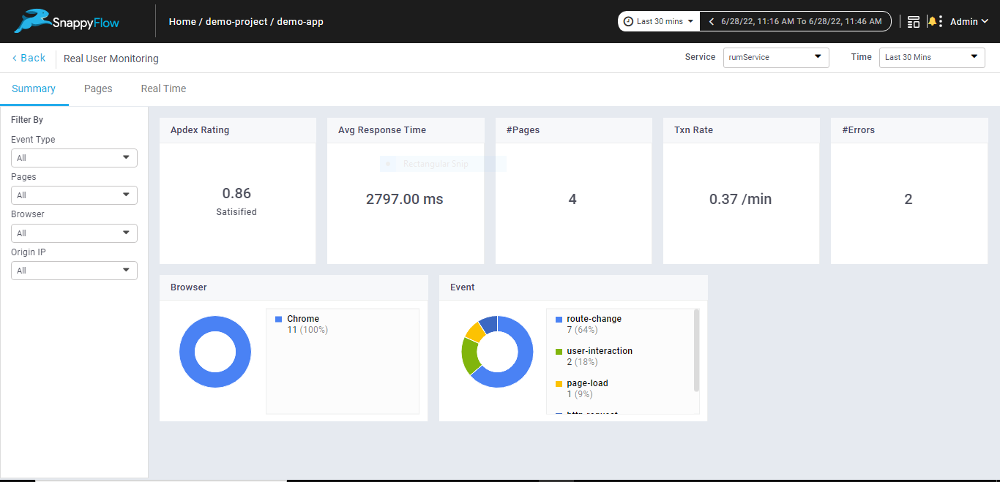
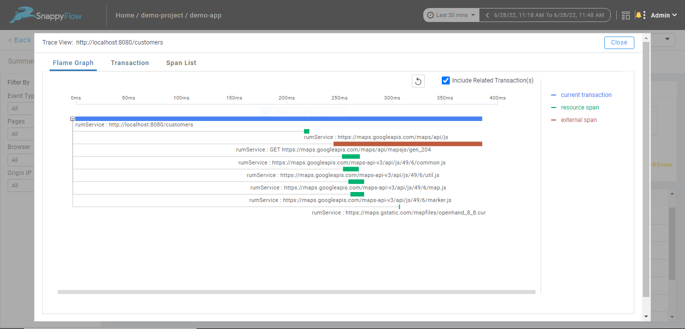

# Real User Monitoring in SnappyFlow

Real User Monitoring (RUM) involves recording end-user interactions with a website or a client interacting with a server or cloud-based application. It  allows website/application owners to visualize the sequence of actions and events that takes place during an interaction. Metrics such as Response time, Transactions, Errors, Event information, Browser information are monitored and visualized to help identify and troubleshoot website performance issues. 






## Performance Metrics

- **Apdex Rating**  
	Apdex (Application Performance Index) is a measure of user satisifaction for a website that varies from 0 to 1 (0 = no users satisfied, 1 = all users satisfied)

- **Page load metrics**  
	During loading of a page, resource timing information of all the dependent resources such as JavaScript, stylesheets, images, etc. are captured.

- **User interactions**  
	The click events that trigger the network activity are captured as user interactions

- **JavaScript errors**  
	The javascript errors that occur in the application are captured. Using the captured information, the root cause of the issue can be analysed


## Setting up Real User Monitoring (RUM) in SnappyFlow

Snappyflow provides a lightweight and powerful `sf-apm-rum` agent that can be installed in your web application to monitor user integrations in real time.

:::note Prerequisites

Any web application developed using javascript or javascript based frameworks like Angular, React etc
:::

### Installing SnappyFlow RUM agent

**Step 1: Install the sf-apm-rum agent**

cd to the project directory and run the below command
```bash
$ npm install --save sf-apm-rum 
```


**Step 2: Import the sf-apm-rum package**

```js
import sfApm from 'sf-apm-rum'; // for npm
	//or
const sfApm = require('sf-apm-rum');
```


:::note Only for Angular 

Add `node_modules/sf-apm-rum/dist/sf-apm-rum.js` in `angular.json` under scripts
Eg:
```scripts: ['node_modules/sf-apm-rum/dist/sf-apm-rum.js']```
:::

:::note Only for Nextjs

Since the library requires Web APIs to work, which are not available when Next.js pre-renders the page on the server-side, we have to use dynamic import here

```js
 useEffect(() => {
 	const initFunction = async () => {
 	const sfApm = await import('sf-apm-rum')
 	}
 	initFunction()
}, [])
```

:::note

**Step3: Configure the sf-apm-rum agent**

```js
declare const sfApm: any; // add it outside class, only for angular applications

let apmRum = new sfApm.ApmRum(); // initialize the library

const data = {
	baseUrl: '<add-snappyflow-server-url-here>',
	profileKey: '<add-profile-key-here>',
	serviceName: '<your-apm-service-name>',
	projectName: '<add-project-name-here>',
	appName: '<add-application-name-here>',
};
apmRum.init(data);
```

**Step4: For Angular based applications only**

Create a new file  `apm-error.handler.ts` add following code

```js
import { ErrorHandler, Injectable } from "@angular/core";
declare const sfApm: any;

@Injectable()
export class ApmErrorHandler extends ErrorHandler {

	constructor() {
		super()
	}

	handleError(error) {
		sfApm.apm.captureError(error.originalError || error)
		super.handleError(error)
	}

}
```

Then in `app.module.ts` add,
```js
import { ErrorHandler, NgModule } from '@angular/core';
import { ApmErrorHandler } from './apm-error.handler';
```

under imports add,
```js
providers: [
	{provide: ErrorHandler, useClass: ApmErrorHandler}
]
```
